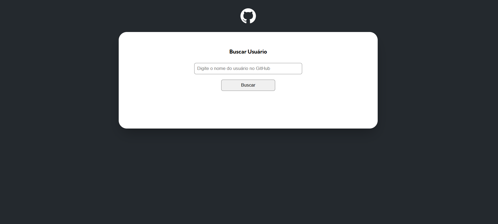

# Projeto com a API do GitHub 

Foco desse projeto e o estudo das api usando a api do GitHub 

[]

esse projeto foi bem desafiador pois foi o primeiro contato real com uma api, porem gostei bastante de fazer ele principalmente pelo fato de adicionar coisas novas na tela 🤯!

[]

Agora foi adicionado novas informações no projeto como linguem utilizada no projeto 

